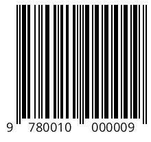
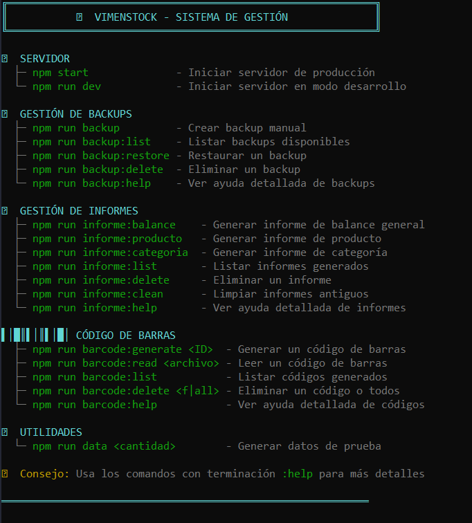

<div align="center">

# 📦 VimenStock v2.1.0

### Sistema de Gestión de Inventario Profesional

[](https://opensource.org/licenses/MIT)
[](https://nodejs.org/)
[]()
[]()

[](https://nodejs.org/)
[](https://developer.mozilla.org/en-US/docs/Web/JavaScript)
[](https://expressjs.com/)

---

**Sistema completo de gestión de inventario con códigos de barras EAN-13, backups automatizados, informes personalizados PDF/Excel, categorías dinámicas, análisis financiero avanzado y sistema profesional de logs.**

[Documentación](#-estructura-del-proyecto) •
[Instalación](#-instalación) •
[Tecnologías](#%EF%B8%8F-tecnologías-utilizadas) •
[CLI Tools - Comandos](#-comandos-disponibles---herramientas-cli)

</div>

<table>
<tr>
<td width="33%" align="center">

### 🗺 Road Map
Consulta el RoadMap para estar enterado de las futuras ideas

[Ver RoadMap](#%EF%B8%8F-roadmap)

</td>
<td width="33%" align="center">

### ❓ FAQ
Encuentra respuestas a preguntas y errores comunes

[Ver FAQ](#-preguntas-frecuentes)

</td>
<td width="33%" align="center">

### 📰 LICENCIA
Consulta el archivo licencia y las guías necesarias

[Ver LICENCIA](#-licencia-1)

</td>
</tr>
</table>

---

## 📸 Capturas de Pantalla

<details>
<summary>📦 <b>Gestión de Productos</b> (Click para expandir)</summary>


```
1️⃣ AÑADIR PRODUCTO
   └─ Clic en "▼ AÑADIR PRODUCTO ▼"
   └─ Completar formulario
   └─ El código de barras se genera automáticamente

2️⃣ EDITAR PRODUCTO
   └─ Botón "Editar" en la tabla
   └─ Modificar campos necesarios
   └─ Guardar cambios

3️⃣ ELIMINAR PRODUCTO
   └─ Botón "Eliminar" en la tabla
   └─ Confirmar eliminación
   └─ Se registra en el historial

4️⃣ VER HISTORIAL
   └─ Botón "Historial" del producto
   └─ Visualiza todos sus movimientos

5️⃣ CÓDIGO DE BARRAS
   └─ Clic en la imagen para ampliar
   └─ Generación automática EAN-13
```

### 🛒 Operaciones de Compra/Venta

#### 📥 Comprar

```
1. Clic en "▼ COMPRAR ▼"
2. Añadir filas con:
   ├─ Código de producto (P001, P002, etc.)
   └─ Cantidad
3. El sistema calcula automáticamente:
   ├─ Precio unitario
   ├─ Precio total por producto
   └─ Total de la operación
4. Confirmar compra
   └─ ✅ Actualiza stock
   └─ ✅ Genera ticket PDF
   └─ ✅ Registra en historial
```

#### 💰 Vender

```
1. Clic en "▼ VENDER ▼"
2. Añadir filas con:
   ├─ Código de producto
   └─ Cantidad (verificación automática de stock)
3. El sistema:
   ├─ Valida disponibilidad
   ├─ Calcula precios
   └─ Muestra total
4. Confirmar venta
   └─ ✅ Actualiza stock
   └─ ✅ Genera ticket PDF
   └─ ✅ Registra en historial
   └─ ⚠️ Alerta si queda stock bajo
```

</details>

<details>
<summary>🏷️ <b>Códigos de Barras EAN-13</b> (Click para expandir)</summary>



**Características:**
- ✅ Generación automática EAN-13
- ✅ Almacenamiento en `data/bar_code/`
- ✅ Opción de ampliación con clic
- ✅ Generación bajo demanda

</details>

<details>
<summary>📜 <b>Historial de Operaciones</b> (Click para expandir)</summary>


**Filtros Disponibles:**

| Filtro | Opciones |
|--------|----------|
| 🔄 Tipo de Operación | Comprado, Vendido, Editado, Eliminado, Añadido |
| 📂 Categoría | Todas las categorías del sistema |
| 📅 Fecha | Fecha exacta o rango de fechas |
| 🔍 ID | Producto o Ticket específico |

**Funcionalidades:**
- 📥 **Descargar tickets**: Clic en el texto azul "Ticket: [ID]"
- 📊 **Operaciones múltiples**: Se expanden mostrando cada producto
- 🔗 **Enlaces directos**: A tickets PDF con efecto hover
- ⏰ **Ordenación**: Por fecha más reciente primero

</details>

<details>
<summary>💰 <b>Análisis Financiero</b> (Click para expandir)</summary>


```
📊 PERÍODOS DISPONIBLES
├─ 📅 Diario    → Ventas/compras del día
├─ 📅 Semanal   → Últimos 7 días
├─ 📅 Mensual   → Últimos 30 días
├─ 📅 Anual     → Últimos 365 días
└─ 📅 Siempre   → Histórico completo

🔍 FILTROS
├─ Por categoría
├─ Por ID de producto
└─ Rango de fechas personalizado

📈 GRÁFICO
├─ 💵 Ingresos (verde)
├─ 💸 Gastos (rojo)
└─ 💰 Beneficio total
```

</details>

<details>
<summary>📈 <b>Estadísticas Avanzadas</b> (Click para expandir)</summary>


**KPIs en Tiempo Real:**

| Métrica | Descripción | Cálculo |
|---------|-------------|---------|
| 💵 Ingresos | Total vendido | Suma de todas las ventas |
| 💸 Gastos | Total comprado | Suma de todas las compras |
| 💰 Beneficio | Ganancia neta | Ingresos - Gastos |
| 📊 Margen | Rentabilidad | (Beneficio / Ingresos) × 100 |
| 🛒 Ventas | Nº operaciones | Conteo de ventas |
| 🎯 Ticket Medio | Promedio venta | Ingresos / Nº ventas |

**Gráficos Interactivos:**

```
📈 Evolución de Ventas (Línea)
   └─ Ventas diarias en el período seleccionado
   └─ Hover para ver detalles exactos

📊 Categorías Rentables (Barras)
   └─ Beneficio por categoría
   └─ Ordenadas de mayor a menor

🍩 Distribución de Stock (Pie)
   └─ Stock por categoría
   └─ Porcentajes visuales
```

**Tablas de Análisis:**

| Tabla | Información |
|-------|-------------|
| 🏆 Top 10 Vendidos | Productos + vendidos con cantidades |
| ⚠️ Stock Bajo | Crítico (<10), Bajo (<25), Agotados (0) |

</details>

<details>
<summary>📊 <b>Listado de Comandos</b> (Click para expandir)</summary>



</details>

<details>
<summary>🎫 <b>Tickets PDF</b> (Click para expandir)</summary>


**Características:**
- ✅ Diseño profesional mejorado
- ✅ Información detallada
- ✅ Formato alineado y legible
- ✅ Soporte para múltiples productos

</details>

---

## 🌟 Características Destacadas v2.1.0

<div align="center">

| 🏷️ EAN-13 | 💾 Backups Auto | 📊 Informes | 📂 Categorías |
|:---:|:---:|:---:|:---:|
| Códigos profesionales | Cada 12 horas | PDF/Excel | Dinámicas |

</div>

### ✨ Novedades de la Versión 2.1.0

<table>
<tr>
<td width="50%">

#### 🏷️ Códigos de Barras EAN-13
- ✅ Formato internacional estándar
- ✅ Dígito de control automático
- ✅ CLI completo para gestión
- ✅ Lector integrado
- ✅ Compatible con lectores comerciales

</td>
<td width="50%">

#### 💾 Sistema de Backups
- ✅ Backups automáticos cada 12h
- ✅ CLI con 28 copias máx
- ✅ Restauración simple
- ✅ Gestión completa
- ✅ Logs de operaciones

</td>
</tr>
<tr>
<td width="50%">

#### 📊 Informes Personalizados
- ✅ Balance General (PDF/Excel)
- ✅ Informe por Producto (PDF)
- ✅ Informe por Categoría (PDF)
- ✅ CLI dedicado
- ✅ Diseño profesional

</td>
<td width="50%">

#### 📂 Categorías Dinámicas
- ✅ Añadir desde la aplicación
- ✅ Sin editar código
- ✅ Validación automática
- ✅ Ordenación alfabética
- ✅ Actualización en tiempo real

</td>
</tr>
</table>

---

## 📁 Estructura del Proyecto

```markdown
├── 📂 data/                     # Datos y archivos generados
│   ├── 📄 data.json             # Base de datos JSON
│   ├── 📂 logs/                 # Sistema de logs
│   │   ├── 📄 app.log           # Log general
│   │   └── 📄 stock_alerts.txt  # Alertas de stock
│   ├── 📂 tickets/              # Tickets PDF
│   │   ├── 📂 compra/
│   │   └── 📂 venta/
│   ├── 📂 bar_code/             # Códigos de barras EAN-13 ⭐
│   │   └── 📄 P001.png
│   └── 📂 informes/             # Informes generados ⭐
│       ├── 📂 general/          # Balance general
│       ├── 📂 productos/        # Informes de productos
│       └── 📂 categorias/       # Informes de categorías
│
├── 📂 docs/                     # Documentación
│   └── 📂 screenshots/          # Capturas de pantalla
│
├── 📂 public/                   # Frontend
│   ├── 🌐 index.html            # Página de productos
│   ├── 🌐 historial.html        # Página de historial
│   ├── 🌐 finanzas.html         # Página de finanzas
│   ├── 🌐 estadisticas.html     # Dashboard estadísticas
│   └── 🎨 style.css             # Estilos principales
│
├── 📂 src/                      # Backend
│   ├── ⚙️ server.js             # Servidor Express + APIs ⭐
│   ├── 📱 app.js                # Lógica principal ⭐
│   ├── 🏷️ barcode-cli.js        # CLI códigos barras ⭐
│   ├── 📷 barcode-reader-cli.js # CLI lector EAN-13 ⭐
│   ├── 💾 backup-cli.js         # CLI backups ⭐
│   ├── 📊 informes-cli.js       # CLI informes ⭐
│   ├── 🔧 generateData.js       # Generador de datos
│   ├── 📜 historial.js          # Gestión de historial
│   ├── 💰 finanzas.js           # Análisis financiero
│   ├── 📈 estadisticas.js       # Estadísticas avanzadas
│   └── 🌓 lightdark.js          # Control modo oscuro
│
├── 📄 .gitignore
├── 📋 CHANGELOG.md              # Historial de cambios ⭐
├── 📜 LICENSE
├── 📖 README.md
├── 📦 package.json              # Scripts CLI añadidos ⭐
└── 🔒 package-lock.json

⭐ = Nuevos/Modificados en v2.1.0
```

---

## 📌 Comandos Disponibles - Herramientas CLI

```bash
# Servidor
npm start              # Iniciar servidor
npm run dev            # Desarrollo con nodemon

# Datos
npm run data           # Generar datos prueba

# Backups ⭐
npm run backup         # Crear backup manual
npm run backup:list    # Listar backups
npm run backup:restore # Restaurar backup
npm run backup:delete  # Eliminar backup
npm run backup:help    # Ayuda completa

# Códigos de Barras ⭐
npm run barcode:generate  # Generar EAN-13
npm run barcode:list      # Listar códigos
npm run barcode:read      # Leer código
npm run barcode:delete    # Eliminar código(s)
npm run barcode:help      # Ayuda completa

# Informes ⭐
npm run informe:balance    # Balance general
npm run informe:producto   # Por producto
npm run informe:categoria  # Por categoría
npm run informe:list       # Listar informes
npm run informe:help       # Ayuda completa
```

---

## 📋 Características Principales

### 📦 Gestión de Inventario

<table>
<tr>
<td>

**Productos**
- ➕ Añadir, editar y eliminar
- 🏷️ Códigos de barras EAN-13 automáticos
- 📊 Organización por categorías
- 🔍 Búsqueda y filtros avanzados
- ⚠️ Alertas de stock bajo

</td>
<td>

**Control de Stock**
- 🛒 Registro de compras
- 💰 Registro de ventas
- 🔄 Actualización automática
- 📈 Cálculo de balance
- 📊 Análisis de rotación

</td>
</tr>
</table>

### 🎫 Operaciones y Tickets

- ✅ **Tickets PDF profesionales** para cada operación
- ✅ **Operaciones múltiples** (varios productos en una transacción)
- ✅ **Historial completo** con filtros avanzados
- ✅ **Descarga directa** de tickets desde el historial
- ✅ **Registro detallado** de precios y cantidades

### 📊 Análisis y Reportes

<table>
<tr>
<td width="33%">

**KPIs en Tiempo Real**
- 💵 Ingresos totales
- 💸 Gastos totales
- 💰 Beneficio neto
- 📊 Margen bruto
- 🛒 Ventas totales
- 🎯 Ticket medio

</td>
<td width="33%">

**Gráficos Interactivos**
- 📈 Evolución de ventas
- 📊 Categorías rentables
- 🍩 Distribución de stock

</td>
<td width="33%">

**Exportación**
- 📊 Excel (4 hojas)
- 🎫 Tickets PDF
- 📜 Historial completo

</td>
</tr>
</table>

---

## 🏷️ Categorías

<details>
<summary>📂 Categorías Predefinidas</summary>

El sistema incluye **10 categorías** por defecto:

```javascript
// Editar: src/server.js
// Buscar: const categorias

const categorias = [
  "Alimentación", "Bebidas", "Limpieza", 
  "Tecnología", "Hogar", "Juguetes", 
  "Cosmética", "Ropa", "Deportes", "Otro"
];
```

</details>

<details>
<summary>➕ Añadir Categorías</summary>

**Desde la Aplicación (Recomendado - v2.1.0):**
1. Ir a "Añadir Producto"
2. Seleccionar "Otro" en Categoría
3. Escribir el nombre de la nueva categoría
4. ✅ Se añade automáticamente y ordena alfabéticamente

**Desde Código (Antes del Primer Inicio):**
```javascript
// Editar: src/server.js
const categorias = [
  "Tu Categoría 1",
  "Tu Categoría 2",
  "Tu Categoría 3",
  // Añade las que necesites
  "Otro"  // Siempre mantener "Otro" al final
];
```

</details>

<details>
<summary>⚠️ Consideraciones Importantes</summary>

| Aspecto | Detalle |
|---------|---------|
| **Productos Existentes** | Mantienen su categoría asignada |
| **Historial** | Las operaciones conservan las categorías originales |
| **Finanzas** | Los registros mantienen las categorías históricas |
| **Filtros** | Se actualizan automáticamente |
| **Compatibilidad** | Los productos con categorías eliminadas seguirán funcionando |

</details>

---

## 🚀 Instalación

<details>
<summary>📋 Requisitos Previos</summary>

```bash
Node.js v14 o superior
npm v6 o superior
```

</details>

<details>
<summary>📥 Guía de Instalación</summary>

```bash
# 1️⃣ Clonar el repositorio
git clone https://github.com/vimen1803/vimenstock.git
cd vimenstock

# 2️⃣ Instalar dependencias
npm install

# 3️⃣ (Opcional) Generar datos de prueba
npm run data

# 4️⃣ Iniciar servidor
npm start

# Para desarrollo con auto-reload
npm run dev
```

</details>

<details>
<summary>🌐 Acceder a la Aplicación</summary>

Abre tu navegador en: **http://localhost:3000**

**El primer inicio:**
- ✅ Crea `data/data.json`
- ✅ Inicializa carpetas necesarias
- ✅ Ejecuta backup automático
- ✅ Configura sistema de logs

</details>

---

## ⚙️ Configuración

<details>
<summary>📌 Cambiar Puerto del Servidor</summary>

```javascript
// Archivo: src/server.js
// Línea: ~15

const PORT = 3000; // Cambiar a 3001, 8080, etc.
```

**Puertos comunes:**
- `3000` - Por defecto
- `8080` - Alternativa popular
- `3001` - Si 3000 está ocupado
- `5000` - Otra alternativa común

</details>

---

<details>
<summary>💾 Configurar Backups</summary>

```javascript
// Archivo: src/server.js
const BACKUP_TIME = 12; // Horas entre backups

// Archivo: src/backup-cli.js
const BACKUP_LIMIT = 28; // Máximo de backups guardados
```

</details>

---

<details>
<summary>⚠️ Umbral de Stock Bajo</summary>

**Por defecto:** `25 unidades`

```javascript
// Editar: src/app.js
const STOCKBAJO = 25; // Ajustar según necesidades
```

</details>

---

<details>
<summary>🎲 Configurar Datos de Prueba</summary>

```javascript
// Archivo: src/generateData.js

// Cambiar cantidad de productos generados
for (let i = 1; i <= 200; i++) { // Cambiar 200 por el número deseado
  // ... código de generación
}

// Personalizar rangos de precios
const precioCompra = (Math.random() * (50 - 1) + 1).toFixed(2);
//                                      ↑    ↑
//                                    Máx  Mín

// Personalizar stock inicial
const stock = Math.floor(Math.random() * (200 - 10) + 10);
//                                          ↑     ↑
//                                        Máx   Mín
```

</details>

---

<details>
<summary>🌐 Acceso desde Otros Dispositivos</summary>

```bash
# 1️⃣ Encontrar tu IP local

# Windows:
ipconfig
# Buscar: "Dirección IPv4"

# Linux/macOS:
ifconfig
# O
ip addr show

# 2️⃣ Acceder desde otro dispositivo
# Formato: http://[TU_IP]:3000
# Ejemplo:
http://192.168.1.100:3000

# 3️⃣ Asegurarse que el firewall permite conexiones
# Windows: Permitir Node.js en el firewall
# Linux: sudo ufw allow 3000/tcp
```

</details>

---

## 💾 Backup y Recuperación

### 📦 Hacer Backup Manual

<details>
<summary><b>Usando CLI (Recomendado)</b></summary>

```bash
# Crear backup inmediato
npm run backup

# Listar todos los backups
npm run backup:list

# Restaurar el más reciente
npm run backup:restore 0

# Ver ayuda completa
npm run backup:help
```

</details>

<details>
<summary><b>Linux / macOS</b></summary>

```bash
# Backup rápido del archivo principal
cp data/data.json data/backup_$(date +%Y%m%d).json

# Backup completo de la carpeta data
cp -r data/ backup_data_$(date +%Y%m%d)/

# Backup comprimido (recomendado)
tar -czf backup_vimenstock_$(date +%Y%m%d).tar.gz data/

# Listar backups
ls -lh backup_*.tar.gz
```

</details>

<details>
<summary><b>Windows</b></summary>

```bash
REM Backup del archivo principal
copy data\data.json data\backup_%date:~-4,4%%date:~-7,2%%date:~-10,2%.json

REM Backup completo de la carpeta
xcopy data backup_data_%date:~-4,4%%date:~-7,2%%date:~-10,2%\ /E /I

REM Comprimir con PowerShell
powershell Compress-Archive -Path data\ -DestinationPath backup_%date:~-4,4%%date:~-7,2%%date:~-10,2%.zip
```

</details>

---

### ♻️ Restaurar desde Backup

<details>
<summary><b>Usando CLI (Recomendado)</b></summary>

```bash
# Listar backups disponibles
npm run backup:list

# Restaurar backup por índice (0 = más reciente)
npm run backup:restore 0

# ⚠️ ADVERTENCIA: Sobrescribe todos los datos actuales
# El sistema espera 3 segundos antes de ejecutar
```

</details>

<details>
<summary><b>Linux / macOS</b></summary>

```bash
# 1️⃣ Detener el servidor
Ctrl + C

# 2️⃣ Restaurar archivo de datos
cp data/backup_20250828.json data/data.json

# 3️⃣ O restaurar carpeta completa
rm -rf data/
cp -r backup_data_20250828/ data/

# 4️⃣ Reiniciar servidor
npm start
```

</details>

<details>
<summary><b>Windows</b></summary>

```bash
# 1️⃣ Detener el servidor
Ctrl + C

# 2️⃣ Restaurar archivo de datos
copy data\backup_20250828.json data\data.json

# 3️⃣ O restaurar carpeta completa
rmdir /s /q data
xcopy /e /i backup_data_20250828 data

# 4️⃣ Reiniciar servidor
npm start
```

</details>

---

## 🛠️ Tecnologías Utilizadas

<details>
<summary>🔧 Backend</summary>

| Tecnología | Versión | Uso |
|------------|---------|-----|
| **Node.js** | ≥14.0.0 | Entorno de ejecución |
| **Express.js** | ^4.18.0 | Framework web |
| **PDFKit** | ^0.13.0 | Generación de tickets PDF |
| **Winston** | ^3.8.0 | Sistema de logs profesional |
| **Canvas** | ^2.11.0 | Generación códigos de barras |
| **JsBarcode** | ^3.11.5 | Códigos EAN-13 |
| **ExcelJS** | ^4.3.0 | Exportación a Excel |

</details>

<details>
<summary>🎨 Frontend</summary>

| Tecnología | Fuente | Uso |
|------------|--------|-----|
| **HTML5/CSS3** | Nativo | Estructura y estilos |
| **JavaScript ES6+** | Nativo | Lógica del cliente |
| **Chart.js** | CDN | Gráficos interactivos |
| **Flatpickr** | CDN | Selector de fechas |

</details>

---

## 📌 API Endpoints

<details>
<summary>📊 Datos</summary>

| Método | Endpoint | Descripción | Body/Params |
|--------|----------|-------------|-------------|
| `GET` | `/api/data` | Obtener todos los datos | - |
| `POST` | `/api/data` | Guardar/actualizar datos | JSON completo |

</details>

<details>
<summary>🎫 Tickets y Documentos</summary>

| Método | Endpoint | Descripción | Params |
|--------|----------|-------------|--------|
| `POST` | `/api/generar-ticket` | Generar ticket PDF | `{ tipo, operaciones, total, fecha }` |
| `GET` | `/api/descargar-ticket/:tipo/:fileName` | Descargar ticket | `tipo: compra\|venta` |

</details>

<details>
<summary>📊 Informes</summary>

| Método | Endpoint | Descripción | Body |
|--------|----------|-------------|------|
| `POST` | `/api/generar-informe` | Generar informe PDF/Excel | `{ tipo, formato, filtros }` |
| `GET` | `/api/descargar-informe/:tipo/:fileName` | Descargar informe | `tipo: general\|productos\|categorias` |

</details>

<details>
<summary>🏷️ Códigos de Barras</summary>

| Método | Endpoint | Descripción | Body |
|--------|----------|-------------|------|
| `POST` | `/api/generar-codigo-barras` | Generar código EAN-13 | `{ id }` |

</details>

<details>
<summary>⚠️ Alertas</summary>

| Método | Endpoint | Descripción | Body |
|--------|----------|-------------|------|
| `POST` | `/api/registrar-alerta-stock` | Registrar alerta | `{ productos: [] }` |

</details>

<details>
<summary>💾 Backups</summary>

| Método | Endpoint | Descripción | Body |
|--------|----------|-------------|------|
| `POST` | `/api/crear-backup` | Crear backup manual | - |

</details>

<details>
<summary>📂 Categorías</summary>

| Método | Endpoint | Descripción | Body |
|--------|----------|-------------|------|
| `POST` | `/api/agregar-categoria` | Añadir nueva categoría | `{ nombreCategoria }` |

</details>

---

## 🔒 Seguridad

<details>
<summary>⚠️ Aviso Importante</summary>

Este sistema **NO incluye autenticación** y está diseñado para:
- ✅ Uso local (localhost)
- ✅ Redes privadas confiables
- ❌ NO para uso en internet público

**Recursos recomendados:**
- [OWASP Top 10](https://owasp.org/www-project-top-ten/)
- [Node.js Security Best Practices](https://nodejs.org/en/docs/guides/security/)

</details>

---

## 🔧 Solución de Problemas

<details>
<summary>❌ <b>El servidor no inicia</b></summary>

**Posibles causas y soluciones:**

```bash
# Verificar puerto disponible
lsof -i :3000  # Linux/Mac
netstat -ano | findstr :3000  # Windows

# Reinstalar dependencias
rm -rf node_modules package-lock.json
npm install

# Verificar versión de Node
node --version  # Debe ser ≥14.0.0

# Revisar logs
cat data/logs/app.log
```

</details>

<details>
<summary>💾 <b>Backups no se crean</b></summary>

**Soluciones:**

```bash
# Verificar permisos
chmod -R 755 backups/  # Linux/Mac

# Crear carpeta manualmente
mkdir -p backups

# Crear backup manual
npm run backup

# Ver logs
tail -f data/logs/app.log
```

</details>

<details>
<summary>🏷️ <b>Códigos de barras no se generan</b></summary>

**Soluciones:**

```bash
# Verificar Canvas instalado
npm list canvas

# Reinstalar Canvas
npm uninstall canvas
npm install canvas

# En Windows, instalar herramientas
npm install --global windows-build-tools

# Verificar permisos
chmod -R 755 data/bar_code/  # Linux/Mac
```

</details>

<details>
<summary>📊 <b>Informes no se generan</b></summary>

**Soluciones:**

```bash
# Crear carpetas manualmente
mkdir -p data/informes/{general,productos,categorias}

# Verificar permisos
chmod -R 755 data/informes/  # Linux/Mac

# Reinstalar dependencias
npm install pdfkit exceljs

# Ver logs
tail -f data/logs/app.log
```

</details>

<details>
<summary>📄 <b>Los tickets no se generan</b></summary>

**Soluciones:**

```bash
# Verificar permisos
chmod -R 755 data/tickets  # Linux/Mac

# Crear carpetas manualmente
mkdir -p data/tickets/compra data/tickets/venta

# Reinstalar PDFKit
npm uninstall pdfkit
npm install pdfkit

# Revisar logs
tail -f data/logs/app.log
```

</details>

<details>
<summary>📌 <b>Error "EADDRINUSE"</b></summary>

**El puerto está ocupado:**

```bash
# Encontrar proceso
lsof -i :3000  # Linux/Mac
netstat -ano | findstr :3000  # Windows

# Matar proceso
kill -9 [PID]  # Linux/Mac
taskkill /PID [PID] /F  # Windows

# O cambiar puerto en src/server.js
const PORT = 3001;  # Usar otro puerto
```

</details>

<details>
<summary>💾 <b>Datos no se guardan</b></summary>

**Verificaciones:**

```bash
# Permisos del archivo
chmod 644 data/data.json  # Linux/Mac

# Verificar que el archivo no esté corrupto
cat data/data.json | python -m json.tool

# Restaurar desde backup si está corrupto
npm run backup:restore 0
```

</details>

---

## ❓ Preguntas Frecuentes

<details>
<summary><b>¿Los datos se guardan automáticamente?</b></summary>

Sí, cada operación se guarda automáticamente en `data/data.json`. No es necesario hacer clic en guardar.

</details>

<details>
<summary><b>¿Los backups son automáticos?</b></summary>

Sí, se ejecutan cada 12 horas automáticamente mientras el servidor está activo. También puedes crear backups manuales con `npm run backup`.

</details>

<details>
<summary><b>¿Puedo añadir categorías sin código?</b></summary>

Sí, desde la versión 2.1.0 puedes añadir categorías directamente desde la aplicación al crear un producto, seleccionando "Otro" y escribiendo el nombre de la nueva categoría.

</details>

<details>
<summary><b>¿Qué es EAN-13?</b></summary>

Es el formato estándar internacional de códigos de barras usado en retail. Tiene 13 dígitos (12 + control) y es compatible con todos los lectores comerciales.

</details>

<details>
<summary><b>¿Cuántos informes puedo generar?</b></summary>

Sin límite. Los informes se organizan automáticamente en carpetas por tipo (general, productos, categorías) con timestamp en el nombre.

</details>

<details>
<summary><b>¿Puedo usar esto en múltiples tiendas?</b></summary>

No directamente. Cada instancia gestiona una sola base de datos local. Para múltiples tiendas:
- Opción 1: Ejecutar múltiples instancias en diferentes puertos
- Opción 2: Migrar a base de datos centralizada (futuro v2.2)

</details>

<details>
<summary><b>¿Hay límite de productos?</b></summary>

No hay límite establecido, pero por rendimiento con JSON se recomienda no superar **10,000 productos**. Para más, considera migrar a MongoDB (planificado v2.2).

</details>

<details>
<summary><b>¿Los códigos de barras son únicos?</b></summary>

Sí, cada producto tiene su código de barras único basado en su ID (P001, P002, etc.) en formato **EAN-13**, estándar internacional.

</details>

<details>
<summary><b>¿Puedo exportar los datos?</b></summary>

Sí, tienes múltiples opciones:
1. **Informes PDF**: Balance general, por producto o categoría
2. **Excel**: Balance general con 4 hojas profesionales
3. **JSON**: Copiar directamente `data/data.json`

</details>

<details>
<summary><b>¿Funciona sin conexión a internet?</b></summary>

Casi completamente. Solo necesita internet para las CDN de:
- Chart.js (gráficos)
- Flatpickr (selector de fechas)

Para uso 100% offline, descarga estas librerías localmente.

</details>

<details>
<summary><b>¿Puedo acceder desde otro dispositivo en mi red?</b></summary>

Sí:
```bash
# Encontrar tu IP
ipconfig  # Windows
ifconfig  # Linux/Mac

# Acceder desde otro dispositivo
http://TU_IP:3000
# Ejemplo: http://192.168.1.100:3000
```

</details>

<details>
<summary><b>¿Cómo hago backup de mis datos?</b></summary>

Ver sección [💾 Backup y Recuperación](#-backup-y-recuperación) para instrucciones detalladas y scripts automáticos.

</details>

<details>
<summary><b>¿Puedo leer códigos de barras de otras fuentes?</b></summary>

Sí, con `npm run barcode:read <archivo.png>` puedes leer cualquier código EAN-13 en formato PNG, no solo los generados por el sistema.

</details>

---

## 🗺️ Roadmap

<details>
<summary>✅ Versión 2.1.0 (actual)</summary>
   
- [X] **💾 Backup automático**: Sistema completo con CLI de gestión
- [X] **📊 Informes personalizados**: PDF/Excel con CLI dedicado
- [X] **📂 Añadir categorías**: Desde la aplicación sin código
- [X] **🏷️ Códigos EAN-13**: Formato internacional profesional
- [X] **📷 Lector de códigos**: CLI para leer EAN-13

</details>

<details>
<summary>📋 Versión 3.0.0 (próxima)</summary>

- [ ] **💻 Base de datos MongoDB**: Migración a BD en la nube
- [ ] **🔔 Notificaciones**: Alertas por email/SMS

</details>

<details>
<summary>🚀 Versión 3.1.0 (futuro)</summary>
   
- [ ] **📡 API REST completa**: Documentación con Swagger
- [ ] **🔐 Autenticación JWT**: Sistema de seguridad
- [ ] **🌐 Multi-tienda**: Gestión centralizada

</details>

---

## 📜 Licencia

Este proyecto está bajo la licencia **MIT**.

```
MIT License

Copyright (c) 2025 Victor Menjon

Se concede permiso, de forma gratuita, a cualquier persona que obtenga una copia
de este software y archivos de documentación asociados (el "Software"), para usar
el Software sin restricciones, incluyendo sin limitación los derechos de usar,
copiar, modificar, fusionar, publicar, distribuir, sublicenciar y/o vender copias
del Software...

Ver archivo LICENSE para el texto completo.
```

---

<div align="center">
  
## 👨‍💻 Autor

**Victor Menjon**

[](https://victormenjon.es)
[](https://github.com/vimen1803)
[](mailto:victormnjfan@gmail.com)

---

## ⭐ ¿Te gusta VimenStock?

Si este proyecto te ha sido útil, considera darle una estrella en GitHub ⭐


[⬆ Volver arriba](#-vimenstock-v210)

---

Desarrollado con ❤️ para facilitar la gestión de inventarios

*v2.1.0 | Octubre 2025*

</div>
