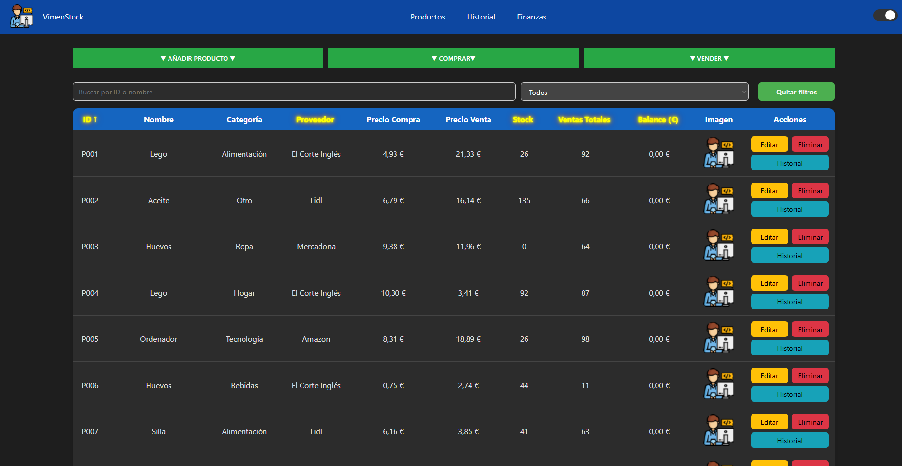
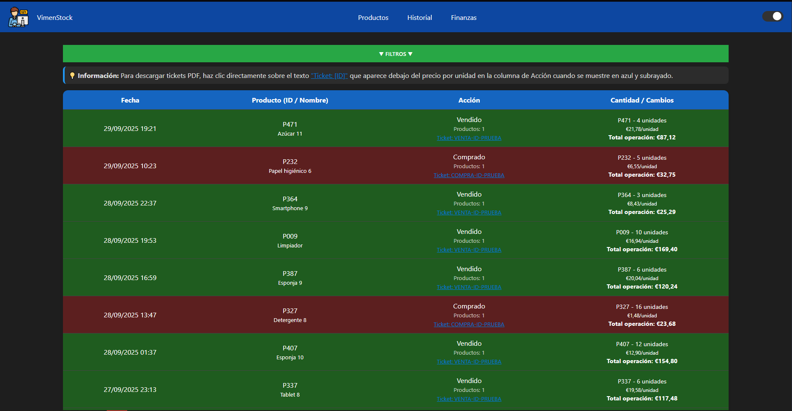

<div align="center">

# 📦 VimenStock v1.0.0

### Sistema de Gestión de Inventario

[](https://opensource.org/licenses/MIT)
[](https://nodejs.org/)
[]()
[]()

[](https://nodejs.org/)
[](https://developer.mozilla.org/en-US/docs/Web/JavaScript)
[](https://expressjs.com/)

---

**Sistema de gestión de inventario con generación automática de tickets PDF, análisis financiero y seguimiento completo de operaciones.**

>  ⚠️ **Nota:** Esta es la versión 1.0.0 (inactiva). Para la última versión con más funcionalidades, consulta la [versión 2.0.0](https://github.com/Vimen1803/awesome-stock/blob/2.0.0/README.md)

[Documentación](#-uso) •
[Instalación](#-instalación) •
[Tecnologías](#-tecnologías-utilizadas)

</div>

<table>
<tr>
<td width="33%" align="center">

### 🗺 Road Map
Consulta el RoadMap para estar enterado de las futuras ideas

[Ver RoadMap](#%EF%B8%8F-roadmap)

</td>
<td width="33%" align="center">

### ❓ FAQ
Encuentra respuestas a preguntas y errores comunes

[Ver FAQ](#-solución-de-problemas)

</td>
<td width="33%" align="center">

### 📰 LICENCIA
Consulta el archivo licencia y las guías necesarias

[Ver LICENCIA](#-licencia-1)

</td>
</tr>
</table>

---

## 📸 Capturas de Pantalla

<details>
<summary>📦 <b>Gestión de Productos</b></summary>

<br>



**Vista principal con:**
- Tabla de productos con información completa
- Filtros por categoría, proveedor y búsqueda
- Controles rápidos de compra y venta
- Botones de edición y eliminación

</details>

<details>
<summary>📜 <b>Historial de Operaciones</b></summary>

<br>



**Seguimiento detallado:**
- Registro cronológico de todas las operaciones
- Filtros por tipo, categoría y fecha
- Enlaces directos a tickets PDF
- Información completa de cada transacción

</details>

<details>
<summary>💰 <b>Análisis Financiero</b></summary>

<br>


**Visualización financiera:**
- Gráfico interactivo de ingresos vs gastos
- Calendario para selección de fechas
- Filtros por período (día, semana, mes, año)
- Cálculo automático de beneficios

</details>

---

## 🌟 Características Destacadas

<div align="center">

| 🌚 Modo Oscuro | 📇 Filtro | 📈 Estadísticas | ⚠️ Guardado Automático |
|:---:|:---:|:---:|:---:|
| Elección Oscuro/Claro | Filtros Variados | Grafico Beneficios | API conectada a JSON |

</div>

---

## 📁 Estructura del Proyecto

```
vimenstock/
│
├── 📂 data/                    # Datos de la aplicación
│   ├── 📄 data.json            # Base de datos JSON principal
│   └── 📂 tickets/             # Tickets PDF generados
│       ├── 📂 compra/          # Tickets de compras
│       └── 📂 venta/           # Tickets de ventas
│
├── 📂 docs/                    # Documentación
│   └── 📂 screenshots/         # Capturas de pantalla
│
├── 📂 public/                  # Archivos del frontend
│   ├── 🌐 index.html           # Página principal (productos)
│   ├── 🌐 historial.html       # Página de historial
│   ├── 🌐 finanzas.html        # Página de finanzas
│   └── 🎨 style.css            # Estilos CSS principales
│
├── 📂 src/                     # Código del servidor
│   ├── ⚙️ server.js            # Servidor Express principal
│   ├── 🔧 generateData.js      # Generador de datos de prueba
│   └── 📱 *.js                 # Módulos del servidor
│
├── 📄 .gitignore               # Archivos ignorados por Git
├── 📜 LICENSE                  # Licencia MIT
├── 📖 README.md                # Este archivo
├── 📦 package.json             # Dependencias y scripts
└── 🔒 package-lock.json        # Versiones exactas de dependencias
```

---

## 🎯 Uso

### 📦 Gestión de Productos

<details>
<summary> ➕ Añadir Producto</summary>

```
1. Clic en "▼ AÑADIR PRODUCTO ▼"
2. Completar el formulario:
   ├─ Nombre del producto
   ├─ Categoría (seleccionar del menú)
   ├─ Proveedor
   ├─ Precio de compra
   ├─ Precio de venta
   └─ Stock inicial
3. Clic en "Añadir Producto"
4. ✅ El producto aparece en la tabla
```
</details>

<details>
<summary> ✏️ Editar Producto</summary>

```
1. Localizar el producto en la tabla
2. Clic en botón "Editar"
3. Modificar los campos necesarios
4. Clic en "Guardar Cambios"
5. ✅ Los cambios se reflejan inmediatamente
```
</details>

<details>
<summary> 🗑️ Eliminar Producto</summary>

```
1. Localizar el producto en la tabla
2. Clic en botón "Eliminar"
3. Confirmar la eliminación
4. ✅ El producto se elimina y se registra en historial
```
</details>

<details>
<summary> 📜 Ver Historial de Producto</summary>

```
1. Clic en botón "Historial" del producto
2. Se abre la página de historial
3. Filtrado automático por ese producto
4. ✅ Visualiza todos los movimientos
```

</details>

---

### 🛒 Operaciones de Compra/Venta

<details>
<summary> 📥 Realizar Compra</summary>

```
┌─────────────────────────────────────────┐
│ 1. Clic en "▼ COMPRAR ▼"                │
├─────────────────────────────────────────┤
│ 2. Añadir productos:                    │
│    ├─ Código de producto (P001, etc.)   │
│    └─ Cantidad a comprar                │
├─────────────────────────────────────────┤
│ 3. Añadir más filas si es necesario     │
│    (botón "➕ Añadir otra fila")        │
├─────────────────────────────────────────┤
│ 4. Revisar:                             │
│    ├─ Precios por producto              │
│    └─ Total de la compra                │
├─────────────────────────────────────────┤
│ 5. Clic en "Confirmar Compra"           │
└─────────────────────────────────────────┘

✅ Resultado:
   ├─ Stock actualizado automáticamente
   ├─ Ticket PDF generado
   ├─ Operación registrada en historial
   └─ Balance actualizado
```
</details>

<details>
<summary> 💰 Realizar Venta</summary>

```
┌─────────────────────────────────────────┐
│ 1. Clic en "▼ VENDER ▼"                 │
├─────────────────────────────────────────┤
│ 2. Añadir productos:                    │
│    ├─ Código de producto                │
│    └─ Cantidad a vender                 │
│    ⚠️ Se valida stock disponible        │
├─────────────────────────────────────────┤
│ 3. Añadir más filas si es necesario     │
├─────────────────────────────────────────┤
│ 4. Revisar:                             │
│    ├─ Precios por producto              │
│    ├─ Stock disponible                  │
│    └─ Total de la venta                 │
├─────────────────────────────────────────┤
│ 5. Clic en "Confirmar Venta"            │
└─────────────────────────────────────────┘

✅ Resultado:
   ├─ Stock reducido automáticamente
   ├─ Ticket PDF generado
   ├─ Operación registrada en historial
   └─ Balance actualizado
```
</details>

---

### 📜 Historial

<details>
<summary>Filtros Disponibles:</summary>

| 🔍 Filtro | 📋 Opciones | 📝 Descripción |
|-----------|-------------|----------------|
| **Tipo de Operación** | Comprado, Vendido, Editado, Eliminado, Añadido | Filtra por tipo de acción |
| **Categoría** | Todas las categorías del sistema | Filtra productos por categoría |
| **Fecha** | Fecha exacta o rango | Usa calendario Flatpickr |
| **ID** | Producto o Ticket | Busca por identificador |

</details>

<details>
<summary>Características:</summary>

```
📊 Visualización
├─ Orden cronológico (más reciente primero)
├─ Información completa de cada operación
├─ Enlaces a tickets PDF (clic en ID azul)
└─ Colores según tipo de operación

🔍 Búsqueda
├─ Por múltiples criterios simultáneos
├─ Filtros combinables
└─ Resultados en tiempo real

📄 Tickets
├─ Descarga directa desde historial
├─ Clic en texto azul "Ticket: [ID]"
└─ Se abre el PDF automáticamente
```

</details>

---

### 💰 Análisis Financiero

<details>
<summary>Períodos Disponibles:</summary>

| Período | Descripción | Uso |
|---------|-------------|-----|
| 📅 **Diario** | Hoy | Ventas/compras del día |
| 📅 **Semanal** | 7 días | Últimos 7 días |
| 📅 **Mensual** | 30 días | Último mes |
| 📅 **Anual** | 365 días | Último año |
| 📅 **Siempre** | Todo | Histórico completo |

</details>

<details>
<summary>Filtros Adicionales:</summary>

```
🔍 Filtrar por:
├─ 📂 Categoría específica
├─ 📦 ID de producto
└─ 📅 Rango de fechas personalizado (calendario)

📊 Gráfico Interactivo:
├─ 💵 Ingresos (área verde)
├─ 💸 Gastos (área roja)
├─ 💰 Beneficio total destacado
└─ Hover para ver detalles exactos
```
</details>

<details>
<sumamry>Cómo usar:</sumamry>

```
1️⃣ Seleccionar período predefinido
   └─ O usar calendario para rango personalizado

2️⃣ (Opcional) Aplicar filtros
   └─ Categoría o producto específico

3️⃣ Visualizar resultados
   ├─ Gráfico se actualiza automáticamente
   ├─ Total de ingresos
   ├─ Total de gastos
   └─ Beneficio calculado

4️⃣ Analizar tendencias
   └─ Identificar períodos más rentables
```
</details>

---

## ✏️ Cómo Editar las Categorías

<details>
<summary><b>Método 1: Antes del Primer Inicio</b> ⭐ Recomendado</summary>

<br>

**Paso a paso:**

```javascript
// 1️⃣ Abrir archivo: src/server.js

// 2️⃣ Buscar la función: inicializarDataJSON()

// 3️⃣ Modificar el array de categorías:

const dataInicial = {
  categorias: [
    "Electrónica",        // Tu categoría 1
    "Muebles",            // Tu categoría 2
    "Decoración",         // Tu categoría 3
    "Accesorios",         // Tu categoría 4
    "Ferretería",         // Tu categoría 5
    "Papelería",          // Tu categoría 6
    "Mascotas",           // Tu categoría 7
    "Libros",             // Tu categoría 8
    "Música",             // Tu categoría 9
    "Otros"               // Tu categoría 10
  ],
  productos: {},
  historial: [],
  finanzas: [],
  ultimaIDUsada: 0
};

// 4️⃣ Guardar archivo

// 5️⃣ Ejecutar:
```

```bash
npm start
```

✅ **Ventajas:**
- Las categorías están desde el inicio
- No hay productos con categorías antiguas
- Configuración limpia

</details>

<details>
<summary><b>Método 2: Después del Primer Inicio</b></summary>

<br>

**Paso a paso:**

```bash
# 1️⃣ Detener el servidor
Ctrl + C

# 2️⃣ Abrir archivo de datos
# Ubicación: data/data.json
```

```json
{
  "categorias": [
    "Tu Nueva Categoría 1",
    "Tu Nueva Categoría 2",
    "Tu Nueva Categoría 3",
    "..."
  ],
  "productos": { 
    // No modificar esta sección
  },
  "historial": [
    // No modificar esta sección
  ],
  "finanzas": [
    // No modificar esta sección
  ]
}
```

```bash
# 3️⃣ Guardar cambios

# 4️⃣ Reiniciar servidor
npm start
```

⚠️ **Consideraciones:**
- Los productos existentes mantienen su categoría anterior
- Asegúrate de que el JSON sea válido (usa un validador online)
- Haz backup antes de modificar

</details>

---

<details>
<summary>⚠️ Consideraciones Importantes</summary>


| Aspecto | Detalle |
|---------|---------|
| **Productos Existentes** | Mantienen su categoría asignada incluso si eliminas esa categoría del array |
| **Historial** | Las operaciones registradas conservan las categorías originales |
| **Finanzas** | Los registros financieros mantienen las categorías históricas |
| **Filtros** | Se actualizan automáticamente con las nuevas categorías |
| **Compatibilidad** | Los productos con categorías eliminadas seguirán funcionando |

**Recomendación:** Si vas a cambiar categorías con productos existentes, considera:
1. Hacer backup de `data/data.json`
2. Editar manualmente los productos para asignar nuevas categorías
3. O mantener las categorías antiguas como "legacy"

</details>

---

---

## 🚀 Instalación

<details>
<summary> 📋 Requisitos Previos</summary>

```bash
Node.js v14 o superior
npm v6 o superior
```

</details>

<details>
<summary> 📥 Guía de Instalación</summary>

```bash
# 1️⃣ Clonar el repositorio
git clone https://github.com/tu-usuario/vimenstock.git
cd vimenstock

# 2️⃣ Instalar dependencias
npm install

# 3️⃣ (Opcional) Generar datos de prueba
npm run data

# 4️⃣ Iniciar servidor
npm start

# Para desarrollo con auto-reload
npm run dev
```

</details>

<details>
<summary>🌐 Acceder a la Aplicación</summary> 

Abre tu navegador en: **http://localhost:3000**

</details>

---

## ⚙️ Configuración

<details>
<summary>🔌 Cambiar Puerto del Servidor</summary> 

```javascript
// Archivo: src/server.js
// Línea: ~15

const PORT = 3000; // Cambiar a 3001, 8080, etc.
```

**Puertos comunes:**
- `3000` - Por defecto
- `8080` - Alternativa popular
- `3001` - Si 3000 está ocupado
- `5000` - Otra alternativa común

</details>

---

<details>
<summary> 🎲 Configurar Datos de Prueba</summary>

```javascript
// Archivo: src/generateData.js

// Cambiar cantidad de productos generados
for (let i = 1; i <= 200; i++) { // Cambiar 200 por el número deseado
  // ... código de generación
}

// Personalizar rangos de precios
const precioCompra = (Math.random() * (50 - 1) + 1).toFixed(2);
//                                      ↑    ↑
//                                    Máx  Mín

// Personalizar stock inicial
const stock = Math.floor(Math.random() * (200 - 10) + 10);
//                                          ↑     ↑
//                                        Máx   Mín
```

</details>

---

<details>
<summary>🌐 Acceso desde Otros Dispositivos</summary> 

```bash
# 1️⃣ Encontrar tu IP local

# Windows:
ipconfig
# Buscar: "Dirección IPv4"

# Linux/macOS:
ifconfig
# O
ip addr show

# 2️⃣ Acceder desde otro dispositivo
# Formato: http://[TU_IP]:3000
# Ejemplo:
http://192.168.1.100:3000

# 3️⃣ Asegurarse que el firewall permite conexiones
# Windows: Permitir Node.js en el firewall
# Linux: sudo ufw allow 3000/tcp
```

</details>

---

## 💾 Backup y Recuperación

### 📦 Hacer Backup Manual

<details>
<summary><b>Linux / macOS</b></summary>

```bash
# Backup rápido del archivo principal
cp data/data.json data/backup_$(date +%Y%m%d).json

# Backup completo de la carpeta data
cp -r data/ backup_data_$(date +%Y%m%d)/

# Backup comprimido (recomendado)
tar -czf backup_vimenstock_$(date +%Y%m%d).tar.gz data/

# Listar backups
ls -lh backup_*.tar.gz
```

</details>

<details>
<summary><b>Windows</b></summary>

```bash
REM Backup del archivo principal
copy data\data.json data\backup_%date:~-4,4%%date:~-7,2%%date:~-10,2%.json

REM Backup completo de la carpeta
xcopy data backup_data_%date:~-4,4%%date:~-7,2%%date:~-10,2%\ /E /I

REM Comprimir con PowerShell
powershell Compress-Archive -Path data\ -DestinationPath backup_%date:~-4,4%%date:~-7,2%%date:~-10,2%.zip
```

</details>

---

### ♻️ Restaurar desde Backup

<details>
<summary><b>Linux / macOS</b></summary>
  
```bash
# 1️⃣ Detener el servidor
Ctrl + C

# 2️⃣ Restaurar archivo de datos
cp data/backup_20250828.json data/data.json

# 3️⃣ O restaurar carpeta completa
rm -rf data/
cp -r backup_data_20250828/ data/

# 4️⃣ Reiniciar servidor
npm start
```
</details>

<details>
<summary><b>Windows</b></summary>

```bash
# 1️⃣ Detener el servidor
Ctrl + C

# 2️⃣ Restaurar archivo de datos
copy data\backup_20250828.json data\data.json

# 3️⃣ O restaurar carpeta completa
rmdir /s /q data
xcopy /e /i backup_data_20250828 data

# 4️⃣ Reiniciar servidor
npm start
```

</details>

---


## 🛠️ Tecnologías Utilizadas

<details>
<summary> 🔧 Backend</summary>

| Tecnología | Versión | Propósito |
|------------|---------|-----------|
| **Node.js** | ≥14.0.0 | Entorno de ejecución JavaScript |
| **Express.js** | ^4.18.0 | Framework web minimalista |
| **PDFKit** | ^0.13.0 | Generación de documentos PDF |
| **Winston** | ^3.8.0 | Sistema de logging profesional |
</details>

<details>
<summary> 🎨 Frontend</summary>summary>

| Tecnología | Fuente | Propósito |
|------------|--------|-----------|
| **HTML5** | Nativo | Estructura de páginas |
| **CSS3** | Nativo | Estilos y diseño responsive |
| **JavaScript ES6+** | Nativo | Lógica del cliente |
| **Chart.js** | CDN (v3.9.1) | Gráficos interactivos |
| **Flatpickr** | CDN (v4.6.13) | Selector de fechas avanzado |
</details>

## 🔧 Solución de Problemas

<details>
<summary>❌ <b>Error: El servidor no inicia</b></summary>

<br>

**Síntomas:**
- Error "EADDRINUSE"
- Puerto ya en uso
- Servidor no responde

**Soluciones:**

```bash
# 1️⃣ Verificar si el puerto está ocupado

# Linux/macOS:
lsof -i :3000

# Windows:
netstat -ano | findstr :3000

# 2️⃣ Matar el proceso

# Linux/macOS:
kill -9 [PID]

# Windows:
taskkill /PID [PID] /F

# 3️⃣ O cambiar el puerto en src/server.js

# 4️⃣ Reinstalar dependencias
rm -rf node_modules package-lock.json
npm install

# 5️⃣ Verificar versión de Node
node --version  # Debe ser ≥14.0.0
```

</details>

<details>
<summary>📄 <b>Error: Los tickets no se generan</b></summary>

<br>

**Síntomas:**
- No se crea el PDF
- Error en consola al hacer compra/venta
- Carpeta tickets vacía

**Soluciones:**

```bash
# 1️⃣ Verificar permisos de carpetas
chmod -R 755 data/tickets/

# 2️⃣ Crear carpetas manualmente si no existen
mkdir -p data/tickets/compra
mkdir -p data/tickets/venta

# 3️⃣ Verificar instalación de PDFKit
npm list pdfkit

# 4️⃣ Reinstalar PDFKit
npm uninstall pdfkit
npm install pdfkit

# 5️⃣ Revisar logs
tail -f data/logs/app.log

# 6️⃣ Verificar espacio en disco
df -h  # Linux/macOS
```

</details>

<details>
<summary>💾 <b>Error: Los datos no se guardan</b></summary>

<br>

**Síntomas:**
- Cambios se pierden al reiniciar
- Error al añadir/editar productos
- data.json no se actualiza

**Soluciones:**

```bash
# 1️⃣ Verificar permisos del archivo
chmod 644 data/data.json

# 2️⃣ Verificar que el archivo no esté corrupto
cat data/data.json | python -m json.tool
# O usar validador online: jsonlint.com

# 3️⃣ Verificar espacio en disco
df -h

# 4️⃣

```
</details>

---
## 🛠️ Solución de problemas

<details>
<summary> El servidor no inicia</summary>

* Verificar que el puerto 3000 esté disponible
* Comprobar instalación de dependencias: `npm install`
* Revisar logs en `data/logs/app.log`
</details>

<details>
<summary>Los tickets no se generan</summary>

* Verificar permisos de escritura en carpeta `data/tickets`
* Revisar logs en `data/logs/app.log`
* Comprobar que PDFKit esté instalado correctamente
</details>

<details>
<summary>Error "EADDRINUSE"</summary>

El puerto 3000 está ocupado:

```bash
# Opción 1: Encontrar y cerrar el proceso
lsof -i :3000  # Linux/Mac
netstat -ano | findstr :3000  # Windows

# Opción 2: Cambiar el puerto en src/server.js
```
</details>

## ❓ Preguntas Frecuentes

<details>
<summary>¿Los datos se guardan automáticamente?</summary>
 
Sí, cada operación se guarda automáticamente en `data/data.json`.
</details>

<details>
<summary>¿Puedo usar esto en múltiples tiendas?</summary>
 
No directamente. Cada instancia gestiona una sola base de datos local. Para múltiples tiendas necesitarías múltiples instancias o migrar a una base de datos centralizada.
</details>

<details>
<summary>¿Hay límite de productos?</summary>
  
  No hay límite establecido, pero por rendimiento se recomienda no superar 10,000 productos con el almacenamiento JSON actual.
</details>

<details>
<summary>¿Funciona sin conexión a internet?</summary>
  
Casi completamente. Solo necesita internet para las CDN de librerías (Chart.js, Flatpickr) en el frontend.
</details>

<details>
<summary>¿Puedo acceder desde otro dispositivo en mi red?</summary>
  
  Sí, usa la IP local del servidor: `http://192.168.1.X:3000`
</details>

---

## 🗺️ Roadmap

<details>
<summary> Versión 2.0.0 (próximamente)</summary>
   
- [ ] **✨ Códigos de Barras**: Generación automática de códigos de barras Code 128 para cada producto
   
- [ ] **📊 Exportación a Excel**: Exporta inventario completo con múltiples hojas y formato profesional
      
- [ ] **⚠️ Alertas de Stock Bajo**: Sistema automático de alertas cuando el stock es mínimo
      
- [ ] **📈 Página de Estadísticas**: Nueva sección con KPIs, gráficos interactivos y análisis detallado a tiempo real
      
- [ ] **🎨 Mejoras Visuales**: Interfaz renovada con mejor UX y feedback visual
      
- [ ] **🔧 Optimizaciones**: Mejor rendimiento y gestión de memoria
   
</details>

<details>
<summary> Versión 2.1.0 (futuro)</summary>
   
- [ ] **💻 Base de datos**: Mudanza de base de datos online (MongoDB)
   
- [ ] **⚠️ Alertas de Stock Bajo**: Notificaciones por email para alertas de stock
      
- [ ] **📋 Backup automático**: Se programa un back-up que hace copias de los datos

</details>

---

## 📜 Licencia

Este proyecto está bajo la licencia **MIT**.

```
MIT License

Copyright (c) 2025 Victor Menjon

Se concede permiso, de forma gratuita, a cualquier persona que obtenga una copia
de este software y archivos de documentación asociados (el "Software"), para usar
el Software sin restricciones, incluyendo sin limitación los derechos de usar,
copiar, modificar, fusionar, publicar, distribuir, sublicenciar y/o vender copias
del Software...

Ver archivo LICENSE para el texto completo.
```

---

<div align="center">
  
## 👨‍💻 Autor

**Victor Menjon**

[](https://victormenjon.es)
[](https://github.com/vimen1803)
[](mailto:victormnjfan@gmail.com)

</div>

---

<div align="center">

## ⭐ ¿Te gusta VimenStock?

Si este proyecto te ha sido útil, considera darle una estrella en GitHub ⭐


---

<div align="center">
  
[⬆ Volver arriba](#-vimenstock)
  
--- 
Desarrollado con ❤️ para facilitar la gestión de inventarios

*v1.0.0 | Agosto 2025*
</div>
</div>
