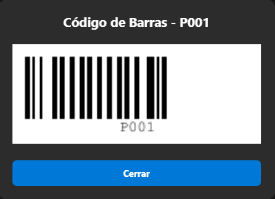
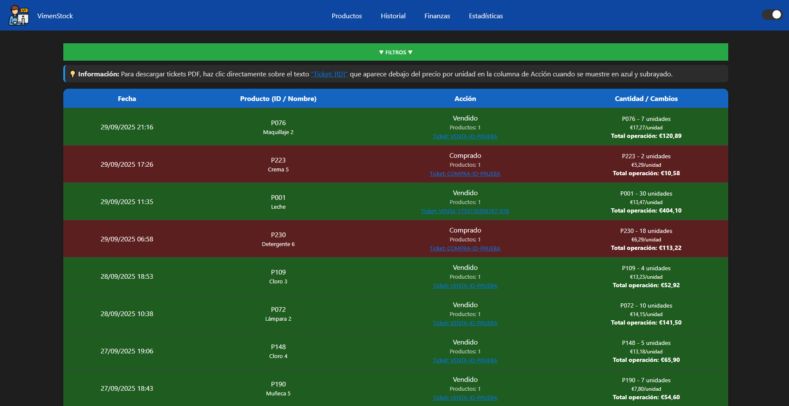
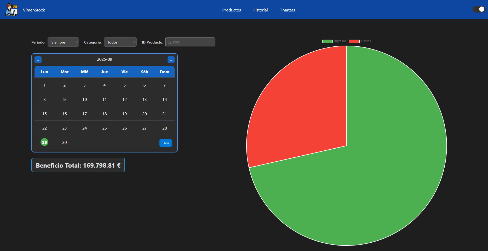
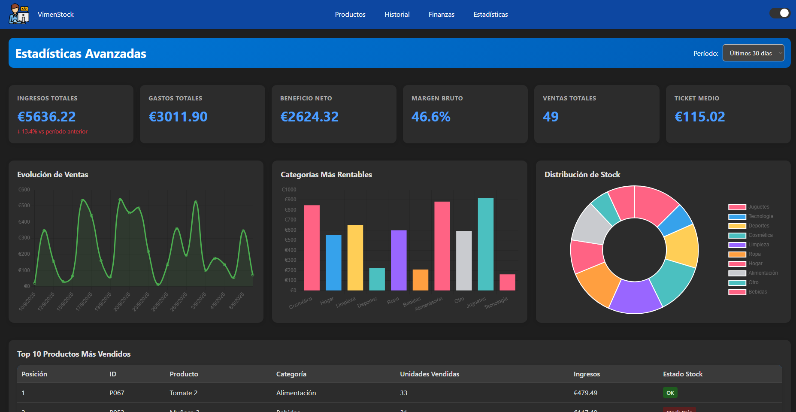
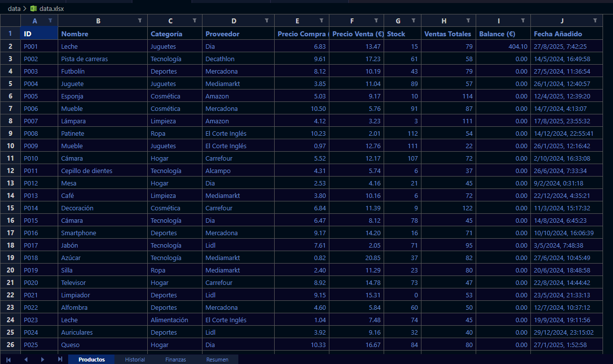
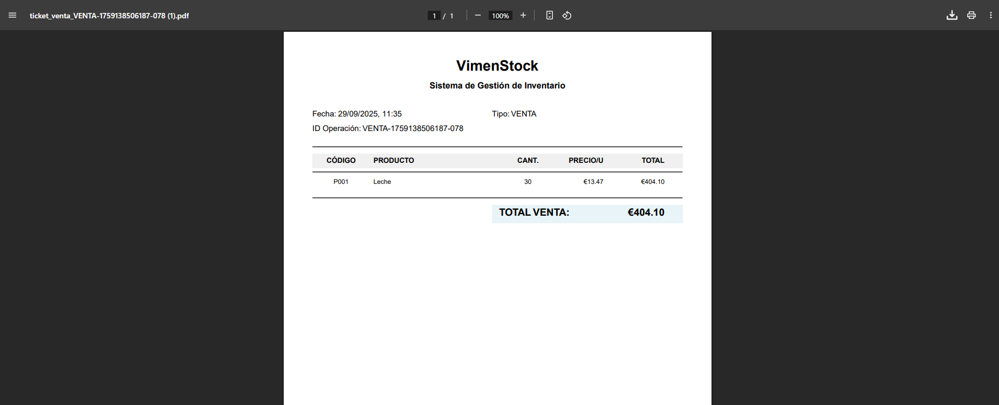

# VimenStock 📦 v2.0.0

[](https://opensource.org/licenses/MIT)
[](https://nodejs.org/)
[]()
[](CHANGELOG.md)

Sistema de gestión de inventario profesional con generación automática de tickets PDF, códigos de barras, exportación a Excel, análisis financiero avanzado y sistema completo de logs.

## 🎉 Novedades en v2.0.0

- **✨ Códigos de Barras**: Generación automática de códigos de barras Code 128 para cada producto
- **📊 Exportación a Excel**: Exporta inventario completo con múltiples hojas y formato profesional
- **⚠️ Alertas de Stock Bajo**: Sistema automático de alertas cuando el stock es inferior a 25 unidades
- **📈 Página de Estadísticas**: Nueva sección con KPIs, gráficos interactivos y análisis detallado
- 🎱** Dashboard con métricas en tiempo real
- **🎨 Mejoras Visuales**: Interfaz renovada con mejor UX y feedback visual
- **🔧 Optimizaciones**: Mejor rendimiento y gestión de memoria

## 📸 Capturas de Pantalla

### Gestión de Productos

*Vista principal con tabla de productos, códigos de barras, filtros y controles de compra/venta. Incluye indicadores visuales de stock bajo y botón de exportación a Excel.*

### Códigos de Barras


*Generación automática de códigos de barras Code 128 para cada producto con opción de ampliación.*

### Historial de Operaciones

*Seguimiento completo de operaciones con filtros avanzados, descarga de tickets PDF y visualización de operaciones múltiples.*

### Análisis Financiero

*Gráficos de ingresos vs gastos con calendario interactivo y filtros por período, categoría y producto.*

### Estadísticas Avanzadas

*Dashboard completo con KPIs en tiempo real, gráficos interactivos y tablas de análisis de productos más vendidos y stock bajo.*

### Exportación a Excel

*Archivo Excel generado con 4 hojas: Productos, Historial, Finanzas y Resumen con formato profesional.*

### Sistema de Tickets PDF

*Tickets profesionales con información detallada de operaciones, productos y totales.*

## 📋 Características Principales

### Gestión de Inventario
* **Gestión de Productos**: Añadir, editar y eliminar productos con información detallada
* **Control de Stock**: Registro de compras y ventas con actualización automática
* **Códigos de Barras**: Generación automática en formato Code 128 para cada producto
* **Categorización**: Organización de productos por categorías personalizables
* **Filtros Avanzados**: Búsqueda y filtrado por múltiples criterios

### Operaciones y Tickets
* **Tickets PDF**: Generación automática de tickets profesionales para cada operación
* **Operaciones Múltiples**: Compra/venta de varios productos en una sola operación
* **Historial Completo**: Seguimiento detallado de todas las operaciones realizadas
* **Descarga de Tickets**: Acceso directo a los tickets PDF desde el historial

### Análisis y Reportes
* **Estadísticas Avanzadas**: KPIs en tiempo real (ingresos, gastos, beneficio, margen)
* **Análisis Financiero**: Visualización de ingresos vs gastos con gráficos interactivos
* **Exportación a Excel**: Genera archivos Excel con 4 hojas: Productos, Historial, Finanzas y Resumen
* **Top Productos**: Ranking de productos más vendidos y análisis de rotación
* **Alertas de Stock**: Identificación automática de productos con stock bajo

### Sistema de Logs
* **Logs de Aplicación**: Registro completo en `data/logs/app.log`
* **Alertas de Stock**: Registro específico en `data/logs/stock_alerts.txt`
* **Formato Estructurado**: Logs con timestamp, nivel y mensaje detallado

### Interfaz y UX
* **Modo Oscuro**: Interfaz adaptable para mayor comodidad visual
* **Diseño Responsivo**: Adaptable a diferentes tamaños de pantalla
* **Notificaciones**: Feedback visual inmediato de todas las operaciones
* **Navegación Intuitiva**: Menú superior con acceso rápido a todas las secciones

## 🚀 Instalación

### Requisitos previos

* Node.js (v14 o superior)
* npm (v6 o superior)

### Pasos de instalación

1. **Clonar el repositorio**

```bash
git clone https://github.com/tu-usuario/vimenstock.git
cd vimenstock
```

2. **Instalar dependencias**

```bash
npm install
```

3. **Generar datos de prueba (opcional)**

```bash
npm run data
```

4. **Iniciar el servidor**

```bash
npm start
```

Para desarrollo con recarga automática:

```bash
npm run dev
```

5. **Acceder a la aplicación**

Abrir el navegador en `http://localhost:3000`

## 📁 Estructura del proyecto

```
vimenstock/
├── data/
│   ├── data.json           # Base de datos JSON
│   ├── logs/              # Archivos de registro
│   │   ├── app.log        # Log general de la aplicación
│   │   └── stock_alerts.txt # Alertas de stock bajo (NUEVO)
│   └── tickets/           # Tickets PDF generados
│       ├── compra/        # Tickets de compra
│       └── venta/         # Tickets de venta
│
├── docs/
│   ├── bar_code/          # Códigos de barras generados (NUEVO)
│   └── screenshots/       # Capturas de pantalla
│
├── public/
│   ├── index.html         # Página de productos
│   ├── historial.html     # Página de historial
│   ├── finanzas.html      # Página de finanzas
│   ├── estadisticas.html  # Página de estadísticas (NUEVO)
│   └── style.css          # Estilos principales
│
├── src/
│   ├── server.js          # Servidor Express con nuevas APIs
│   ├── generateData.js    # Generador de datos de prueba
│   ├── app.js            # Lógica principal del cliente
│   ├── historial.js      # Gestión del historial
│   ├── finanzas.js       # Análisis financiero
│   ├── estadisticas.js   # Estadísticas avanzadas (NUEVO)
│   └── lightdark.js      # Control modo oscuro
│
├── .gitignore
├── CHANGELOG.md          # Historial de cambios (NUEVO)
├── LICENSE
├── README.md
├── package-lock.json
└── package.json
```

## 🎯 Uso

### Gestión de Productos

1. **Añadir producto**: Clic en "▼ AÑADIR PRODUCTO ▼" y completar el formulario
2. **Editar producto**: Botón "Editar" en la tabla de productos
3. **Eliminar producto**: Botón "Eliminar" en la tabla de productos
4. **Ver historial**: Botón "Historial" para ver movimientos del producto
5. **Código de barras**: Se genera automáticamente al crear el producto

### Operaciones de Compra/Venta

1. **Comprar**:
   * Clic en "▼ COMPRAR ▼"
   * Añadir filas con código de producto y cantidad
   * El sistema calcula automáticamente precios y totales
   * Confirmar compra (genera ticket PDF)

2. **Vender**:
   * Clic en "▼ VENDER ▼"
   * Añadir filas con código de producto y cantidad
   * Verificación automática de stock disponible
   * Confirmar venta (genera ticket PDF y alerta si queda stock bajo)

### Historial

* **Filtros disponibles**:
  * Por tipo de operación (Comprado, Vendido, Editado, etc.)
  * Por categoría
  * Por fecha (exacta o rango)
  * Por ID de producto o ticket
* **Descargar tickets**: Clic en el texto azul "Ticket: [ID]"
* **Visualización**: Operaciones múltiples expandidas con detalle

### Análisis Financiero

* **Períodos**: Diario, semanal, mensual, anual o siempre
* **Filtros**: Por categoría o ID de producto
* **Calendario**: Selección visual de fechas
* **Gráfico**: Visualización tipo pie de ingresos vs gastos

### Estadísticas Avanzadas (NUEVO)

* **KPIs en tiempo real**:
  - Ingresos totales
  - Gastos totales
  - Beneficio neto
  - Margen bruto
  - Ventas totales
  - Ticket medio

* **Gráficos interactivos**:
  - Evolución de ventas (línea temporal)
  - Categorías más rentables (barras)
  - Distribución de stock (dona)

* **Tablas de análisis**:
  - Top 10 productos más vendidos
  - Productos con stock bajo (crítico/bajo/agotado)

### Exportación a Excel (NUEVO)

1. Clic en el botón "📊 Exportar a Excel" en la página de productos
2. Se genera automáticamente un archivo `data.xlsx` con 4 hojas:
   - **Productos**: Listado completo del inventario
   - **Historial**: Todas las operaciones realizadas
   - **Finanzas**: Registros de ingresos y gastos
   - **Resumen**: Métricas generales y estadísticas

### Alertas de Stock Bajo (NUEVO)

* Se activan automáticamente cuando el stock es inferior a 25 unidades
* Registro en `data/logs/stock_alerts.txt` con formato:
  
  ```
  P001 - Producto Ejemplo - Stock Disponible: 15 - 29/09/2025 14:30:45
  ```
* Visualización en la tabla de productos (número en rojo y negrita)

## 🛠️ Tecnologías utilizadas

### Backend

* **Express.js**: Framework web
* **PDFKit**: Generación de tickets PDF
* **Winston**: Sistema de logs profesional
* **Canvas**: Generación de códigos de barras
* **ExcelJS**: Exportación a Excel
* **Node.js**: Entorno de ejecución

### Frontend

* **HTML5/CSS3**: Estructura y estilos
* **JavaScript (ES6+)**: Lógica del cliente
* **Chart.js**: Gráficos financieros y estadísticos
* **Flatpickr**: Selector de fechas

## 📊 Categorías

### Categorías predefinidas

El sistema incluye 10 categorías por defecto:

* Alimentación
* Bebidas
* Limpieza
* Tecnología
* Hogar
* Juguetes
* Cosmética
* Ropa
* Deportes
* Otro

### Personalización de categorías

#### Opción 1: Antes del primer inicio (Recomendado)

1. Abrir `src/server.js`
2. Buscar `inicializarDataJSON()`
3. Modificar el array de `categorias`

#### Opción 2: Después del primer inicio

1. Detener el servidor (Ctrl + C)
2. Editar `data/data.json`
3. Modificar el array de `categorias`
4. Reiniciar el servidor

## 📝 Sistema de Logs

### Logs de aplicación (`app.log`)

Registra todas las operaciones del sistema:

```
2025-09-29 14:30:45 info: Servidor corriendo en http://localhost:3000
2025-09-29 14:31:12 info: Ticket generado: ticket_venta_VENTA-1727621472123-456.pdf
2025-09-29 14:31:15 info: Excel exportado: data.xlsx
```

### Alertas de stock (`stock_alerts.txt`)

Registra productos con stock bajo después de cada venta:

```
P001 - Leche Entera - Stock Disponible: 18 - 29/09/2025 14:31:12
P045 - Café Molido - Stock Disponible: 12 - 29/09/2025 14:31:12
```

## 🔧 Configuración

### Puerto del servidor

Por defecto: `3000`

Para cambiar el puerto, editar en `src/server.js`:

```javascript
const PORT = 3000; // Cambiar aquí
```

### Umbral de stock bajo

Por defecto: `25 unidades`

Para cambiar, editar en `app.js`:

```javascript
const STOCKBAJO = 25; // Cambiar aquí
```

### Datos iniciales

Modificar `src/generateData.js` para cambiar la cantidad de productos de prueba:

```javascript
for (let i = 1; i <= 200; i++) { // Cambiar el número aquí
  // ...
}
```

## 💾 Backup y Recuperación

### Hacer backup manual

```bash
# Copiar el archivo de datos
cp data/data.json data/backup_$(date +%Y%m%d).json

# Copiar toda la carpeta data (incluye tickets y logs)
cp -r data/ backup_data/

# Copiar códigos de barras
cp -r docs/bar_code/ backup_bar_code/
```

### Restaurar desde backup

```bash
# 1. Detener el servidor (Ctrl + C)

# 2. Restaurar el archivo
cp data/backup_20250929.json data/data.json

# 3. Reiniciar el servidor
npm start
```

## 📡 API Endpoints

### Datos
* `GET /api/data` - Obtener todos los datos
* `POST /api/data` - Guardar datos

### Tickets y Documentos
* `POST /api/generar-ticket` - Generar ticket PDF
* `GET /api/descargar-ticket/:tipo/:fileName` - Descargar ticket
* `GET /api/exportar-excel` - Exportar datos a Excel

### Códigos de Barras
* `POST /api/generar-codigo-barras` - Generar código de barras Code 128

### Alertas
* `POST /api/registrar-alerta-stock` - Registrar alertas de stock bajo

## 🎨 Características adicionales

* **Modo oscuro persistente**: Se guarda en localStorage
* **Ordenación de tablas**: Clic en cabeceras (ID, Stock, Ventas, Balance, Proveedor)
* **Formato de moneda**: Automático en formato español (€)
* **Validaciones**: Control de stock, productos duplicados, campos requeridos
* **Notificaciones**: Feedback visual de todas las operaciones
* **Códigos de barras**: Generación automática en formato Code 128
* **Responsive**: Interfaz adaptable a diferentes pantallas

## 🔒 Seguridad

⚠️ **Importante**: Este sistema NO incluye autenticación y está diseñado para uso local o en redes privadas.

### Para uso en producción, considerar:

* ✅ HTTPS con certificados SSL/TLS
* ✅ Sistema de autenticación (JWT, OAuth)
* ✅ Validación y sanitización de entradas
* ✅ Rate limiting para prevenir abusos
* ✅ Configuración adecuada de CORS
* ✅ Hash de contraseñas (bcrypt)
* ✅ Logs de auditoría (ya implementado)
* ✅ Protección contra inyección SQL (si migras a BD relacional)
* ✅ Backups automáticos programados

## 🛠️ Solución de problemas

### El servidor no inicia

* Verificar que el puerto 3000 esté disponible
* Comprobar instalación de dependencias: `npm install`
* Revisar logs en `data/logs/app.log`

### Los tickets no se generan

* Verificar permisos de escritura en carpeta `data/tickets`
* Revisar logs en `data/logs/app.log`
* Comprobar que PDFKit esté instalado correctamente

### Los códigos de barras no se muestran

* Verificar permisos de escritura en `docs/bar_code`
* Comprobar que Canvas esté instalado correctamente
* Revisar logs en `data/logs/app.log`

### La exportación a Excel falla

* Verificar permisos de escritura en `data/`
* Comprobar que ExcelJS esté instalado
* Revisar logs en `data/logs/app.log`

### Error "EADDRINUSE"

El puerto 3000 está ocupado:

```bash
# Opción 1: Encontrar y cerrar el proceso
lsof -i :3000  # Linux/Mac
netstat -ano | findstr :3000  # Windows

# Opción 2: Cambiar el puerto en src/server.js
```

## ❓ Preguntas Frecuentes

- **¿Los datos se guardan automáticamente?**
  Sí, cada operación se guarda automáticamente en `data/data.json`.

- **¿Puedo usar esto en múltiples tiendas?**
  No directamente. Cada instancia gestiona una sola base de datos local. Para múltiples tiendas necesitarías múltiples instancias o migrar a una base de datos centralizada.

- **¿Hay límite de productos?**
  No hay límite establecido, pero por rendimiento se recomienda no superar 10,000 productos con el almacenamiento JSON actual.

- **¿Los códigos de barras son únicos?**
  Sí, cada producto tiene su código de barras único basado en su ID (P001, P002, etc.) en formato Code 128.

- **¿Puedo exportar los datos?**
  Sí, puedes usar la función de exportación a Excel o copiar directamente `data/data.json`.

- **¿Funciona sin conexión a internet?**
  Casi completamente. Solo necesita internet para las CDN de librerías (Chart.js, Flatpickr) en el frontend.

- **¿Puedo acceder desde otro dispositivo en mi red?**
  Sí, usa la IP local del servidor: `http://192.168.1.X:3000`

- **¿Qué formato tienen los códigos de barras?**
  Code 128, uno de los formatos más utilizados en retail y logística.

## 🗺️ Roadmap

### Versión 2.1.0 (próximamente)
- [ ] Base de datos (MongoDB)
- [ ] Notificaciones por email para alertas de stock
- [ ] Backup automático programado

### Versión 3.0.0 (futuro)
- [ ] Lector de códigos de barras con webcam
- [ ] Autenticación y autorización multiusuario
- [ ] API REST completa para integraciones

## 📄 Licencia

MIT License - Ver archivo [LICENSE](LICENSE) para más detalles

## 👨‍💻 Autor

[Victor Menjon](https://victormenjon.es)

## 📮 Soporte

* Consultar la sección de [Preguntas Frecuentes](#-preguntas-frecuentes)
* Revisar los [logs del sistema](#-sistema-de-logs)
* Consultar el [historial de cambios](CHANGELOG.md)

## 🙏 Agradecimientos

Gracias a todos los que han probado y dado feedback durante el desarrollo de VimenStock.

---

**Desarrollado con ❤️ para facilitar la gestión de inventarios**

*Versión 2.0.0 - Septiembre 2025*
